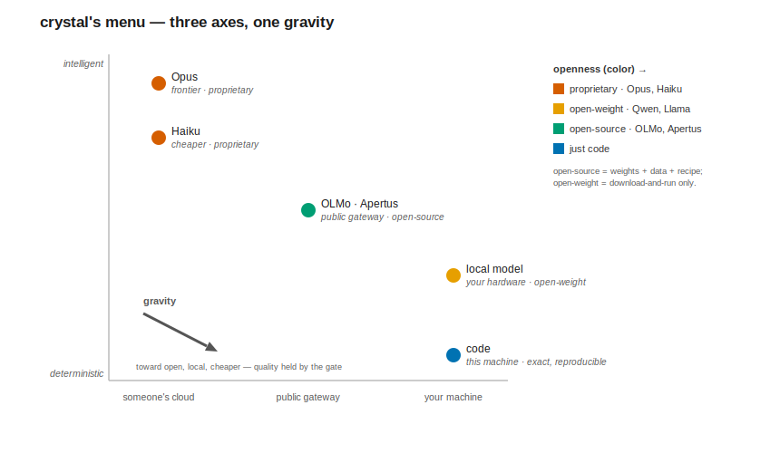
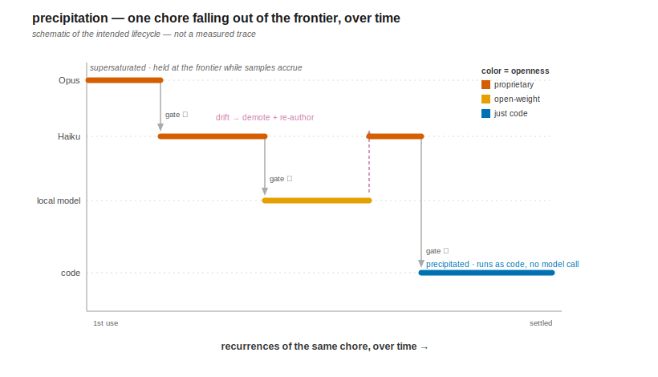

# crystal

> ⚠️ **Alpha — a personal research prototype, shared unusually early.** Small-*N* experiments,
> working-notes shorthand, and flags that will change. Read the `--verbose` output and the `docs/`
> findings before trusting any number. Breakage expected; feedback welcome.

**What it does.** crystal watches your Claude Code transcripts, finds recurring mechanical work, and
migrates it off the expensive frontier model onto cheaper, more deterministic, more local tiers — but
only behind a **verifier** that **demotes** the cheap tier the moment it stops reproducing the frontier's
output. The win is determinism, latency, and sovereignty — *not* token cost. Today it ships the smallest
grain: one deterministic hook. Whole-procedure and whole-codebase crystallization is the roadmap.
*(It runs — there's a 30-second, no-key demo below.)*

## Why "crystal"

An expensive LLM session is a *supersaturated solution* — it holds more recurring, mechanical work than
it should. crystal lets that work **nucleate**, **crystallize**, and **precipitate** out: the stable,
reusable part falls below the frontier into a cheaper, eventually-deterministic tier and stays there
until it drifts. The ambition is for whole bodies of code and procedure to crystallize out of expensive
sessions over time — not just one-off rules. Today's built grain is `guard` above (a rule found
re-encoded in 4 of this author's projects); the reach is the **roadmap, not a claim**
([`docs/ROADMAP.md`](docs/ROADMAP.md), [`docs/THESIS.md`](docs/THESIS.md)).

## The menu, and which way it falls

It's a **menu, not a ladder.** Three *independent* axes:

- **executor** — who does the work; intelligence traded for determinism as you go down.
- **placement** — where it runs; cloud convenience traded for sovereignty as you move onto hardware you own.
- **openness** — proprietary → open *weights* (downloadable-and-runnable, training data/recipe withheld — Qwen, Llama) → open *source* (weights **+** data **+** recipe; **OLMo** is the clean case — Apache-2.0 + open data; Apertus is comparably documented but ships under a custom acceptable-use license) → just code. Open-source sits **past** open-weight here: a model you can *rebuild* beats one you can only download.

"Shift-left" is **gravity over this menu**: a recurring chore falls toward the bottom of the executor axis,
the local end of placement, and the open end of openness — *as far as a verifier will let it go*. Each
downward step is only safe because the gate confirms it; when the cheap tier drifts, the chore **floats
back up a tier**.

|  ↓ executor | chemistry stage | runs on (placement) | openness | what you gain | built? |
|---|---|---|---|---|---|
| **frontier LLM** (Opus) | *dissolved* — the supersaturated session | cloud API | proprietary | max intelligence | baseline |
| **cheaper LLM** (Haiku) | *nucleating* | cloud API | proprietary | ~46% median latency, slight Δquality | measured |
| **open-source, hosted** (e.g. OLMo, Apertus) | *crystallizing* | a hosted open-model gateway | **open source** (OLMo: weights + data + recipe) | ~an order of magnitude under frontier hosted pricing; no local VRAM-spill stall | wired + probed |
| **local model** + agreement oracle | *crystallizing* | your own GPU box | open-weight today (open-source runs here too) | matches Haiku on the ~74% the oracle doesn't abstain on (N=250, wide CI) | measured, early |
| **deterministic hook** (`guard`) | *precipitated* — fallen out of solution | this machine | fully open — it's just code | exact reproducibility, zero variance, no API key | built |



*Position carries the two ordinal axes — **executor** (top→bottom: intelligence → determinism) and
**placement** (left→right: someone's cloud → your machine); **color** carries the third, **openness**
(text labels repeat it, so the figure doesn't rely on color alone). The tiers are positions, not a
sequence — `gravity` is a tendency (toward open, local, cheaper — quality held only where the verifier
passes), not a required path. Note the crossing the colors reveal: the most-open tier here (OLMo/Apertus,
open-**source**) is hosted, while this deployment's local box runs an open-**weight** model — so openness
and placement genuinely decouple (nothing stops an open-source model running locally).*

The axes are independent — that's the whole point of a menu. A chore can shift *down* without leaving the
cloud (Opus→Haiku), move onto your own hardware without getting dumber, or go **open without coming home**:
a hosted gateway can serve *fully open-source* models you don't run yourself. Adding a tier — a new
open-model gateway, a different local backend — just widens the menu; it doesn't change the gravity.

### …and it falls over repeated use

The fall isn't instant — it's driven by **recurrence**. The schematic below shows the *intended*
lifecycle: a chore enters at the frontier, and each time it recurs the verifier decides whether it can
drop a tier, with drift floating it back up:



*Schematic of the intended lifecycle, **not a measured trace**. What's actually built today is the
**Opus→Haiku** drop behind a deterministic gate, plus drift detection; the **local-model** and **code**
tiers are roadmap. The x-axis is **recurrence**: crystal crystallizes only what it has seen **recur**, then
the artifact persists. That recurrence-trigger is the real contrast with per-task model routers (RouteLLM,
Copilot/Cursor "Auto"): they amortize *offline* into a learned policy and pick a model per prompt; crystal
amortizes over *one user's observed recurrences* into an inspectable, deterministically-gated artifact for
a *specific* chore, and demotes it on drift. The difference is what gets amortized (a population policy vs
a per-chore verifiable replacement) — see [`docs/PRIOR_ART.md`](docs/PRIOR_ART.md). The watch-don't-ask
instinct is inspired by [lucida](https://github.com/justinstimatze/lucida), which passively mints
visualizations from a Claude Code session as it happens rather than on request — crystal applies the same
stance to recurring chores.*

## Why bother

The frontier model is the bottleneck on axes that *don't* go away as token prices fall:

- **Determinism** — a crystallized deterministic hook is exactly reproducible; no sampling variance. The most durable win, and one a cloud model structurally can't give you.
- **Latency** — a local/cheap tier skips the frontier round-trip and big-model decode; compounds across call-hungry agentic loops. *Conditional* on the gate being deterministic (no added round-trip) and authoring amortizing over many hits.
- **Sovereignty & openness** — the cheap tier can run on hardware you own, on open-weight or fully open-source models, with no proprietary-API dependency or data egress. *Partial, honestly:* steady-state inference is sovereign, but the self-authoring/re-authoring step still touches the frontier.
- **Throughput / ratelimit headroom** — frees finite frontier budget for the cognitive core. Real today, but a transient artifact that fades as frontier supply grows.

The win is explicitly **not** token cost — frontier prices are collapsing, so "save tokens" is the wrong
frame. *Openness* here means license + reproducibility — an *access* property, not governance; this is an
unaffiliated personal project and takes no position on the broader "public AI" program. (The open-weight
vs open-source distinction above follows [Public AI](https://publicai.network/whitepaper)'s framing, cited
for that one distinction only.)

## Try it (30 seconds, no API key)

`guard` is the smallest crystallized grain — a deterministic PreToolUse hook that denies `git add -A`.
Pipe it a tool event; it denies the indiscriminate stage and allows an explicit one:

```sh
echo '{"tool_name":"Bash","tool_input":{"command":"git add -A"}}'      | go run . guard   # → permissionDecision: deny
echo '{"tool_name":"Bash","tool_input":{"command":"git add main.go"}}' | go run . guard   # → permissionDecision: allow
```

Trivial on its own — the point isn't the rule, it's that it's exactly reproducible with no key and no
model call. **On your own data**, `crystallize` runs the whole lifecycle with no LLM in the loop: scan
transcripts, find the dominant repetitive deterministic command, propose a hook, gate it on determinism,
serve a holdout while watching for drift, demote if it drifts:

```sh
go run . crystallize --home ~ --match "git status"
```

`git status` output depends on working-tree state, so this example **REFUSES** — that's the gate working,
not a failure. Point `--match` at a stable-output command (a `--version`, a fixed query) to see a PROMOTE
write a deployable artifact. The loud refusal is the feature. *(A more compelling, end-to-end demo is on
the [roadmap](docs/ROADMAP.md) — see below.)*

## How it stays honest

Cheap tiers are *worse*, so shifting left naively trades a quality collapse you won't notice for speed.
Two built mechanisms hold the line:

- **A verifier gate** — work migrates down only if a check confirms it reproduces the frontier outcome,
  and is **demoted when it drifts in a way the verifier can express.** The difference between a real win
  and silent rot. *Limit:* a deterministic check can't see semantic drift it can't express, and a
  self-improving tier will game a verifier it can reach (the [DGM](docs/THESIS.md) result). A
  **tamper-proof** gate is **not yet built**, so today's gate is the gameable kind beyond a fixed hook.
- **Self-authoring** — the frontier tier writes the cheap tier's harness and re-writes it on drift, so a
  migration doesn't rot the way a hand-written static replacement does.

**The sharper move is to decompose, not just downshift.** Hand a cheap model only the small fuzzy gap and
let it drive a robust deterministic tool for the rest — a cheap model + `grep` to verify a quote beats a
frontier model doing it from scratch, and the tool's output is trivially gate-able. Your cost is set by
the fraction you *can't* hand to a tool. The honest limit, proven by our own measured leak: **semantic
judgment doesn't offload** — a tool helps where the hard part is mechanical, not "which entity is the
subject." The deeper hypothesis ([`docs/THESIS.md`](docs/THESIS.md)): the master variable is the
*cheaply-verifiable fraction*, not the model tier — you place work as cheaply as you can *verify* it.

So the honest claim is **automatic, drift-surviving shift-left with loud degradation** — *held quality* on
the verifier-covered fraction, *detection + demotion* (not guaranteed reproduction) on the residual.

### What's been measured

Two knobs decide whether shift-left is safe: **g** — does a verifier catch the cheap tier's errors (which
work is safe to migrate down) — and **λ** — does the supervisory signal survive relay (how deep
supervision reaches before going blind). Four by-construction experiments grounded them; **only
`ground-hop` runs on real transcript records**, the other three on one 14-item synthetic corpus, so the
depth/content conclusions rest on the constructed side.

| experiment | question | result |
|---|---|---|
| `ground-hop` | g on byte-exact tool drift (real records) | **g = 1.00** — but the trivial regime where the check is string-equality |
| `uncover-hop` | g when a check provably can't catch the error | **g = 0.00** on the in-source-distractor class — uncatchable by any substring check |
| `depth-sweep` | does error *detection* compound-lose over relay depth? | flat at 1.00 through depth 6 |
| `content-sweep` | does *corrective content* compound-lose? | flat at ~0.70 through depth 6 — loss is at hop 1, not depth |

**The payoff** (`payoff`, the first value-prop measurement): shifting a chore Opus→Haiku behind a
deterministic gate saved **~46% median latency** at *mostly*-held quality (0.86 vs Opus 0.93) — but the
deterministic gate leaks in-source semantic errors, so "held quality" is conditional on a gate that covers
the error mode. A tradeoff, not a free lunch. Numbers are small-*N* with wide CIs and live in the findings
docs — *don't quote them as constants*; read the `--verbose` output, which is checked against raw per-item
output before anything is called a finding. ([`PAYOFF_FINDINGS.md`](docs/PAYOFF_FINDINGS.md) and the
grounding arc below.)

## Status — built vs. not

> **Built and tested:** the eval/promote/demote gate, the drift detector, the `crystallize` lifecycle,
> `guard`, four grounding experiments, the topology sim, and a local small-model tier with a two-model
> agreement oracle (measured at N=250, wired into the hook loop as an experiment — not battle-tested).
> **Not built:** LoRA, a **tamper-proof kernel** (the authored tier structurally can't rewrite the gate
> above it — aspirational), composition over non-linear loop topologies, anything running unattended over
> time. The defensible open sub-problem is narrow: a tamper-proof kernel *across a self-authoring/drift
> loop* (substantial prior art — AI Control, reward-tampering; see [`docs/PRIOR_ART.md`](docs/PRIOR_ART.md)).
> The findings docs are ground truth; this README summarizes.

## Building and running

Go 1.25, [kong](https://github.com/alecthomas/kong) CLI. Live experiments need `ANTHROPIC_API_KEY` in
`.env` (or the environment); every LLM call is disk-cached by content hash, so re-runs are free.

```sh
go build ./...        # or: go run . <subcommand>
go test ./...         # internal/eval/eval_test.go is the Phase-1 go/no-go gate

# everyday surface:
go run . guard                                       # the deterministic constraint hook (see "Try it")
go run . triage --verbose                            # map-reduce + verifier on a real chore, 0 frontier calls
go run . crystallize --home ~ --match "git status"   # the shift-left lifecycle on your own data

# grounding experiments (research probes behind the findings docs):
go run . payoff --verbose        # latency saved vs quality held, Opus→Haiku behind a gate
go run . ground-hop --verbose    # g and per-hop λ on real byte-exact drift
go run . uncover-hop --verbose   # the g<1 regime + fuzzy recovery of the residual
```

The committed `testdata/corpus` is **synthetic** (`go run . synth-corpus`, no real content); run `go run .
extract --home ~` to build fixtures from your *own* transcripts. `go run . --help` for the full list
(most subcommands beyond the everyday surface are research probes).

## Reading order (for the details)

1. [`docs/THESIS.md`](docs/THESIS.md) — how the framing evolved and honest SOTA positioning; [`PROJECT_BRIEF.md`](PROJECT_BRIEF.md) is the original charter.
2. [`docs/ROADMAP.md`](docs/ROADMAP.md) — what's built, what's next, and the vertical slice that would prove the thesis.
3. [`docs/PRIOR_ART.md`](docs/PRIOR_ART.md) — citation map: which primitives are prior art, which seams survive.
4. [`docs/SUBSTRATE_SURVEY.md`](docs/SUBSTRATE_SURVEY.md) — the real transcript schema the gate is built around.
5. **The grounding arc, in order:** [`EXPERIMENT_FINDINGS.md`](docs/EXPERIMENT_FINDINGS.md) → [`GROUNDHOP_FINDINGS.md`](docs/GROUNDHOP_FINDINGS.md) → [`UNCOVERHOP_FINDINGS.md`](docs/UNCOVERHOP_FINDINGS.md) → [`DEPTHSWEEP_FINDINGS.md`](docs/DEPTHSWEEP_FINDINGS.md) → [`CONTENTSWEEP_FINDINGS.md`](docs/CONTENTSWEEP_FINDINGS.md) → [`PAYOFF_FINDINGS.md`](docs/PAYOFF_FINDINGS.md).

## Hard rules (from the brief, still binding)

- **No verifier, no crystallization.** An unregistered tool/channel is *unverifiable*, never a silent pass.
- **Fail loud.** Every divergence is localized; empty/ambiguous verdicts are surfaced, never defaulted.
- **Stable kernel.** A tier may author the harness *below* it; it must not rewrite the gate *above* it (aspirational — today's gate isn't yet tamper-proof).
- **Demote more aggressively than you promote**, and never demote judgment to a tier that can't carry it.
