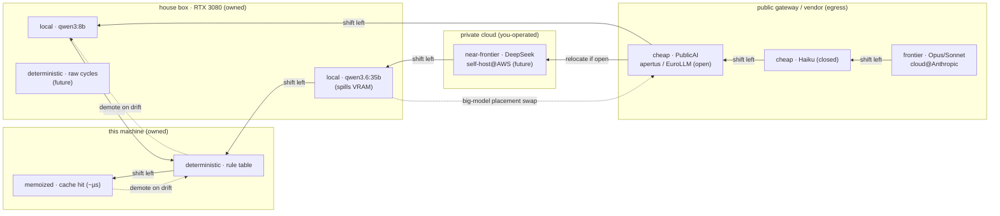

# The execution menu — executor × placement × openness (2026-06-08)

> Refines the 1-D "compute-substrate gradient" in `THESIS.md` (§How far down does
> shift-left go). That section drew **one axis** (frontier → cheap → local → …).
> This is the correction: it's a **menu over two axes plus one modifier**, composed
> per chore under a *gravitational pull left* — not a ladder you descend.

## The one-line reframe

Shift-left is **not a strict hierarchy you walk down**. A hybrid loop (in
`Documents/<project>`) is **constructed** from a menu of execution options. The
organizing force is a **gravitational preference**: among options that *keep the
loop working*, prefer the one further left (cheaper / more deterministic / more
sovereign), and **continuously try to drift further left while it still works**.
`demote-on-drift` is the *"while it still works"* clause — the clamp that arrests
the pull when it went too far left.

A richer menu doesn't add a rung — it **widens where the gravity can land**.

## The two axes + the modifier

**Axis 1 — executor (what does the work):**

```
frontier LLM  →  cloud-cheap LLM  →  local LLM  →  deterministic code  →  memoized lookup
   (Opus)         (Haiku, open      (qwen3 on     (rule table, regex,     (.crystal-cache
                   gateway models)   the box)      compiled matcher)        exact-repeat)
```

**Axis 2 — placement (where the executor runs / who operates it):**

```
this machine  →  house box (RTX 3080)  →  private cloud (EC2 / Fly)  →  public gateway / vendor API
 (local, only    (owned compute — as an   (you operate it; US/EU         (3rd-party operator sees
  you see it)      LLM *or* raw cycles)     jurisdiction; you hold logs)    the payload)
```

The two axes are **orthogonal**. The same executor can sit at different
placements; the house box appears under *two different executors* (an LLM via
ollama, or raw deterministic cycles for a big grep/embed/sort).

**Modifier — openness (of the model weights):** open vs closed is **not a privacy
axis** (see below). Its real job is **relocatability**: open weights are what make
a *trusted placement possible*. An open model can be moved to a placement you
operate; a closed model can only ever sit at its vendor. Openness **widens the
placement column** a model can occupy.

## The decision matrix (executor rows × placement columns)

Cells are concrete menu items; `✓live` = wired and verified in this repo.

| executor ↓ / placement → | this machine | house box (3080) | private cloud | public gateway / vendor |
|---|---|---|---|---|
| **frontier LLM** | — | — | (self-host near-frontier *open*, e.g. DeepSeek on AWS — cost-blocked, a real future item) | **Opus / Sonnet** `cloud@Anthropic` ✓live |
| **cloud-cheap LLM** | — | — | — | **Haiku** (closed) ✓live · **PublicAI** apertus-8b/70b, EuroLLM-22B (open) ✓live |
| **local LLM** | (small models on this laptop) | **qwen3:8b / qwen3.6:35b** via ollama ✓live (35B spills past 10 GB VRAM) | — | — |
| **deterministic code** | **rule table / matcher** ✓live (`dispatch`, `author`) | raw owned cycles (grep/embed/sort at scale) — future | (burst deterministic compute) — future | — |
| **memoized lookup** | **`.crystal-cache`** exact-repeat ✓live (~µs, 0 tokens) | — | — | — |

Reading it: a chore's loop is assembled by picking cells. The agreement oracle,
for example, currently pairs `local-LLM@house (qwen3:8b)` with a **big** model
whose placement is a switch — `local-LLM@house (qwen3.6:35b)` *or*
`cloud-cheap-LLM@gateway (apertus-70b)`. The cloud-open big model is the
spill-free option the local 35B can't be on a 10 GB card (verified: the live
hook-loop closed across 28 processes using `qwen3:8b + apertus-70b`).

## The privacy axis — operator/jurisdiction, NOT open/closed

The axis that governs *data egress* is **who operates the endpoint, under whose
law** — independent of model openness:

```
self-hosted @ owned hw   >   you-operated cloud (EC2/Fly)   >   known-vendor API   >   adversarial-jurisdiction API
(only you see it)            (you hold the logs, US/EU)        (Anthropic: contractual    (DeepSeek hosted: PRC
                                                                no-train + retention)       jurisdiction — assume logged)
```

**The proof open/closed is the wrong axis (the DeepSeek case):** DeepSeek is
*open-weights*, so on an open/closed axis it looks like a peer of Apertus/Olmo —
yet its *hosted PRC API* is **higher privacy risk than closed Anthropic**. "Not
as closed as Anthropic, but a default high privacy risk." Open weights and
privacy are independent; conflating them is the error this doc fixes.

What openness *does* buy on the privacy axis is the **escape hatch**:
DeepSeek-via-PRC-API is a no; DeepSeek-self-hosted-on-your-box/AWS is fine —
openness is what *lets you relocate it* to a trusted placement. Claude can never
leave `cloud@Anthropic`. So openness expands trusted-placement reachability; it
is not itself a privacy guarantee.

**Data sensitivity sets the stakes.** Crystal's *own* work is **meta** — a shell
command string → one category word. Low sensitivity; cloud egress is fine *for
this project*. This axis becomes load-bearing **only if crystal becomes the house
compute substrate**, routing arbitrary code / prompts / file contents — then
operator/jurisdiction + a *"this payload must not leave owned hardware"*
classifier become real requirements. Decisions recorded: **don't add
DeepSeek-hosted** (only ever self-hosted); **don't build privacy controls in
crystal yet** (the workload doesn't warrant them).

## The gravitational pull, stated as a rule

For each sub-step of a chore, prefer the **leftmost / lowest** menu cell that:
1. **covers** the sub-step (the deterministic gate confirms fidelity to reference), and
2. **clears the placement/privacy constraint** (sensitive payload → trusted placement only).

Then keep probing further-left cells as patterns stabilize; **demote one cell
right the moment coverage collapses** (drift). The system is never *on* a tier —
it's a distribution over the menu that the gravity keeps pulling left and
demote-on-drift keeps honest.

## The viz seed (for lucida — Mermaid; renders requests flowing between regimes)

`Documents/lucida` mints Mermaid/Vega/animated-SVG from the live session. This
diagram is the seed for "requests flowing between regimes / nodes in regimes":
nodes are menu cells grouped by placement regime; the leftward edges are the
shift-left pull; the dashed back-edge is demote-on-drift.



The "gravity" is every solid right-to-left edge; the dashed edges are the
working-constraint clamp (demote-on-drift) and the placement swap. A live lucida
version would animate a request as a token traversing left until a gate fails,
then bouncing one dashed edge right.
